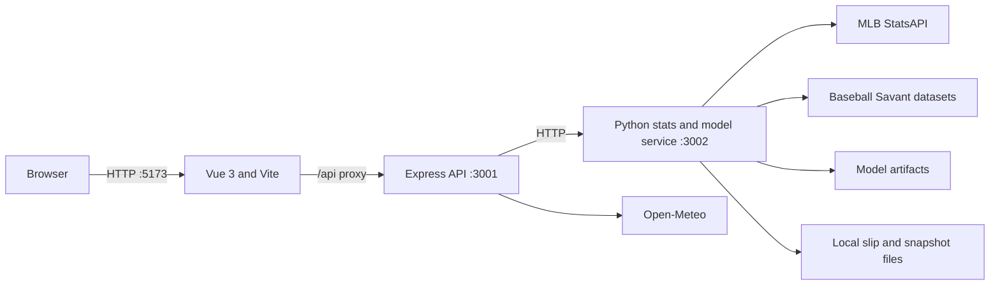

# NINTH

NINTH is a responsive, market-free MLB decision workspace. It combines official schedules, live scores, standings, rosters, player profiles, matchup context, weather, personal slip tracking, and a transparent moneyline prediction model in one application.

The model estimates which team is more likely to win outright. Sportsbook prices and bookmaker odds are intentionally excluded from production training and inference. NINTH is decision-support software, not a guarantee of results.

## Contents

- [Product scope](#product-scope)
- [Architecture](#architecture)
- [Technology](#technology)
- [Data sources](#data-sources)
- [Local setup](#local-setup)
- [Configuration](#configuration)
- [Commands](#commands)
- [Application pages](#application-pages)
- [API reference](#api-reference)
- [Prediction model](#prediction-model)
- [Projection lifecycle](#projection-lifecycle)
- [Slip Builder](#slip-builder)
- [PDF slip tracking](#pdf-slip-tracking)
- [Persistence and multi-user readiness](#persistence-and-multi-user-readiness)
- [Performance and reliability](#performance-and-reliability)
- [Testing](#testing)
- [Production deployment](#production-deployment)
- [Project structure](#project-structure)
- [Known limitations](#known-limitations)
- [Troubleshooting](#troubleshooting)
- [Attribution and responsible use](#attribution-and-responsible-use)

## Product scope

NINTH currently provides:

- A home dashboard with the live slate, best records, and a dynamically selected model brief.
- Daily MLB schedules with date navigation, team filters, probable pitchers, venues, and progressively loaded weather.
- A live center showing every game currently in progress.
- Live game views with scores, inning state, counts, official box-score statistics, batter plate appearances, pitcher workload, play-by-play, and live-adjusted projections.
- Matchup pages with moneyline projections, confidence, input coverage, strongest model contributors, starting pitchers, official personnel, recent team form, and season comparisons.
- Overall, AL, NL, and divisional standings.
- All 30 team pages with current records and complete active rosters grouped into rotation, bullpen, starting lineup, and bench roles.
- An active-player directory and individual player profiles with official headshots and season statistics.
- Global search across teams, players, and nearby games.
- A daily or multi-day moneyline Slip Builder with adjustable leg counts and combined confidence estimates.
- Personal PDF slip import, matching, result tracking, alerts, pagination, and chronological archives.
- A Model Lab exposing walk-forward evaluation, selective accuracy, feature groups, and completed forward predictions.
- Light and dark themes, responsive layouts, custom selects and calendars, loading states, empty states, and recoverable provider errors.

No placeholder games, simulated prices, fake players, or mock projections are intentionally displayed. Missing provider data is represented as pending, unavailable, or unconfirmed.

## Architecture

NINTH runs as three local services during development:



### Service responsibilities

| Service | Default address | Responsibility |
|---|---|---|
| Vue/Vite client | `http://localhost:5173` | Routing, responsive UI, local builder state, polling, loading and error recovery |
| Express API | `http://localhost:3001` | Public API boundary, response normalization, caching, weather coordination, optional odds adapter |
| Python stats service | `http://127.0.0.1:3002` | MLB data access, model inference, projection monitoring, snapshots, slip parsing, maintenance and training integration |

The Vite development server proxies `/api` to Express. Express then communicates with the Python service over localhost.

## Technology

### Frontend

- Vue 3
- Vue Router
- Pinia
- Vite
- Chart.js and vue-chartjs
- Lucide icons
- Custom responsive CSS with light and dark design tokens

### Backend

- Node.js and Express
- Python 3
- `MLB-StatsAPI`
- Requests
- NumPy
- scikit-learn
- Joblib
- pypdf

### Machine learning

- Leakage-safe chronological feature construction
- Walk-forward season evaluation
- Capped run-margin regression followed by probability calibration
- Isotonic confidence calibration
- Prior-start Baseball Savant/Statcast starter aggregates
- Candidate-versus-incumbent promotion gates

## Data sources

| Data | Source | Notes |
|---|---|---|
| Schedules, game states, scores, standings, rosters, season stats, box scores and play-by-play | [MLB StatsAPI](https://github.com/toddrob99/MLB-StatsAPI) | Accessed through the Python adapter |
| Team logos and player headshots | MLB static image services | Components fall back to abbreviations or initials when an image fails |
| Game-time forecasts | [Open-Meteo](https://open-meteo.com/) | Loaded progressively and cached; historical endpoint is used for older games |
| Pitch-level starter history | [Baseball Savant](https://baseballsavant.mlb.com/) | Collected as compact prior-game aggregates; raw pitch downloads are discarded |
| Optional sportsbook adapter | [The Odds API](https://the-odds-api.com/) | Not used by the production model; no simulated odds are shown without a key |

The health endpoint includes `syntheticData: false` so provider status can be audited directly.

## Local setup

### Prerequisites

- Node.js 20 LTS or newer is recommended.
- npm.
- Python 3.10 or newer.
- Network access to MLB and Open-Meteo endpoints.
- A trained `ml/artifacts/moneyline.joblib` and matching `ml/artifacts/report.json` for predictions. These artifacts are ignored by Git and must be trained or transferred separately on a new machine.

### Installation

From the project root:

```powershell
npm install
python -m pip install -r stats-service/requirements.txt
Copy-Item .env.example .env
```

On macOS or Linux, replace the last command with:

```bash
cp .env.example .env
```

### Start all development services

```powershell
npm run dev
```

Open `http://localhost:5173`.

Expected listeners:

- `5173`: Vite client
- `3001`: Express API
- `3002`: Python MLB/model service

Verify the stack with:

```powershell
Invoke-RestMethod http://127.0.0.1:3001/api/health
```

or:

```bash
curl http://127.0.0.1:3001/api/health
```

## Configuration

The Node process reads `.env` from the project root through `dotenv`. The Python service reads the same inherited environment when started through npm.

| Variable | Default | Purpose |
|---|---:|---|
| `PORT` | `3001` | Express API port |
| `MLB_STATS_URL` | `http://127.0.0.1:3002` | Python service URL used by Express |
| `MLB_STATS_PORT` | `3002` | Python service port |
| `NINTH_PROJECTION_MONITOR_ENABLED` | `1` | Enable background pregame/live projection monitoring |
| `NINTH_PREGAME_REFRESH_SECONDS` | `60` | Background pregame reassessment interval; minimum 30 seconds |
| `NINTH_LIVE_REFRESH_SECONDS` | `10` | Background live reassessment interval; minimum 5 seconds |
| `NINTH_GAME_DISCOVERY_SECONDS` | `30` | How often the monitor discovers upcoming/live games |
| `NINTH_PREGAME_MONITOR_HOURS` | `24` | Pregame monitoring horizon |
| `NINTH_MAINTENANCE_ENABLED` | `1` | Enable guarded model/data maintenance checks |
| `NINTH_MAINTENANCE_CHECK_SECONDS` | `3600` | Maintenance check interval; minimum 900 seconds |
| `NINTH_ENRICH_WORKERS` | `6` | Worker count for scheduled context enrichment |
| `NINTH_RETRAIN_GAME_THRESHOLD` | `100` | Retrain after this many new completed games |
| `NINTH_RETRAIN_DAYS` | `7` | Maximum age before retraining when new games exist |
| `NINTH_ARTIFACT_DIR` | `ml/artifacts` | Alternate output directory used during candidate training |
| `THE_ODDS_API_KEY` | empty | Optional odds-provider key; not required by the production application or model |
| `ODDS_REGION` | `us` | Optional odds region |
| `ODDS_FORMAT` | `american` | Optional odds format |

Example `.env`:

```dotenv
PORT=3001
MLB_STATS_URL=http://127.0.0.1:3002
MLB_STATS_PORT=3002

NINTH_PROJECTION_MONITOR_ENABLED=1
NINTH_PREGAME_REFRESH_SECONDS=60
NINTH_LIVE_REFRESH_SECONDS=10
NINTH_GAME_DISCOVERY_SECONDS=30
NINTH_PREGAME_MONITOR_HOURS=24

NINTH_MAINTENANCE_ENABLED=1
NINTH_MAINTENANCE_CHECK_SECONDS=3600
NINTH_ENRICH_WORKERS=6
NINTH_RETRAIN_GAME_THRESHOLD=100
NINTH_RETRAIN_DAYS=7

THE_ODDS_API_KEY=
ODDS_REGION=us
ODDS_FORMAT=american
```

Do not commit `.env` or provider secrets.

## Commands

| Command | Description |
|---|---|
| `npm run dev` | Start Python, Express in watch mode, and Vite |
| `npm run dev:client` | Start only Vite on port 5173 |
| `npm run dev:server` | Start only Express in watch mode |
| `npm run dev:stats` | Start only the Python service |
| `npm run build` | Build the Vue client into `dist/` |
| `npm run preview` | Preview the production client build |
| `npm start` | Start the Python and Express services; it does **not** serve `dist/` |

### Model-data commands

```powershell
# Collect completed official games
python ml/collect.py --start-season 2018 --end-season 2026

# Add point-in-time starters, lineups, bullpen usage and weather
python ml/enrich.py --start-season 2018 --end-season 2026 --workers 12

# Collect resumable Baseball Savant starter aggregates
python ml/statcast_collect.py --start 2018-03-01 --end 2026-07-14

# Train and evaluate V3
python -m ml.train_v3

# Run the guarded maintenance workflow once
python -m ml.maintenance --once

# Inspect maintenance without changing data or artifacts
python -m ml.maintenance --once --dry-run
```

Large collection jobs are resumable where manifests are available. Review provider load and rate limits before increasing worker counts.

## Application pages

| Route | Screen |
|---|---|
| `/` | Home dashboard and model brief |
| `/schedule` | Date-driven MLB schedule |
| `/live` | All games currently live |
| `/live/:id` | Live game center |
| `/games/:id` | Matchup analysis |
| `/builder` | Daily and multi-day Slip Builder |
| `/standings` | Overall, AL, NL and divisional standings |
| `/teams` | Team directory |
| `/teams/:id` | Team room and active roster |
| `/players` | Active-player directory |
| `/players/:id` | Player profile |
| `/model` | Model evaluation and prediction ledger |
| `/slips` | Imported personal slips |
| `/search?q=...` | Full search results |

The `/betting` legacy route redirects to `/model`.

## API reference

All public application endpoints are mounted under `/api` on the Express service.

### System and dashboard

| Method | Endpoint | Description |
|---|---|---|
| `GET` | `/api/health` | Service, provider, maintenance and projection-monitor status |
| `GET` | `/api/dashboard` | Home slate, featured matchup, metrics and standings leaders |
| `GET` | `/api/model` | Current model report and completed prediction ledger |

### Games and projections

| Method | Endpoint | Description |
|---|---|---|
| `GET` | `/api/projection-board?start_date=YYYY-MM-DD&days=N` | Upcoming projection board; `days` is capped at 14 |
| `GET` | `/api/games/today?date=YYYY-MM-DD` | Games for a date |
| `GET` | `/api/games/live?date=YYYY-MM-DD` | Live games for a date |
| `GET` | `/api/games/completed?date=YYYY-MM-DD` | Completed games for a date |
| `GET` | `/api/games/:id/summary` | Fast official matchup shell |
| `GET` | `/api/games/:id` | Full matchup, model context and personnel |
| `GET` | `/api/games/:id/live` | Live game state, box score, plays and projection |

### Teams, players and discovery

| Method | Endpoint | Description |
|---|---|---|
| `GET` | `/api/teams` | All MLB teams and records |
| `GET` | `/api/teams/:id` | Team profile and active roster |
| `GET` | `/api/players` | Active-player directory |
| `GET` | `/api/players/:id` | Player profile and season statistics |
| `GET` | `/api/search?q=term` | Teams, players and nearby games |
| `GET` | `/api/trends` | Official trend summaries |
| `GET` | `/api/rankings` | Official ranking summaries |
| `GET` | `/api/injuries` | Explicit provider-unavailable response when no official source is configured |

### Slips

| Method | Endpoint | Description |
|---|---|---|
| `GET` | `/api/slips` | Enriched slips, newest first |
| `POST` | `/api/slips/import` | Import `{ filename, data }`, where `data` is a base64 PDF data URL |

Provider errors are returned as JSON with an `error` field. The browser client applies an eight-second timeout, retries one failed GET, and exposes recoverable error states instead of waiting forever.

## Prediction model

### Objective

The production model estimates:

```text
P(home team wins)
P(away team wins) = 1 - P(home team wins)
```

It predicts the straight-up winner only. Run lines, totals, sportsbook prices, public betting percentages, and implied probabilities are excluded.

### Current artifact

The local artifact at the time this README was generated reports:

| Metric | Value |
|---|---:|
| Model | `v3_capped_margin_base_plus_long_starter_statcast` |
| Status | Practical provisional promotion |
| Deployment training games | 19,304 |
| Trained through | 2026-07-12 |
| Walk-forward games | 11,141 |
| Walk-forward accuracy | 57.31% |
| Walk-forward Brier score | 0.24237 |
| Qualified accuracy | 62.30% |
| Qualified coverage | 33.27% |
| Recent 2024–2026 outer accuracy | 56.52% |
| Recent outer Brier score | 0.24395 |

These values belong to the current local `report.json`; they will change after a promoted retrain. They are historical evaluation results, not promised future accuracy.

### Feature groups

The deployed artifact contains 29 market-free features:

**Team strength and form**

- Long-term Elo difference, including the learned home-field offset.
- Last-5, last-10 and last-20 win-rate differences.
- Last-10 and last-20 scoring-margin differences.
- Rolling runs scored and rolling run-prevention differences.
- Season winning percentage.
- Pythagorean expected winning percentage.
- Home/road splits and rest differences.

**Starting pitching**

- Starter Elo and rest.
- ERA and WHIP differences.
- Prior-15-start expected wOBA, hard-hit, barrel, whiff, K/BB and velocity advantages.
- Joint Statcast reliability and starter-history depth.

**Matchup context**

- Submitted-lineup OPS difference.
- Bullpen pitches over the previous three days.
- Temperature and wind.
- Context-availability indicator.

Features are constructed using only information available before each historical game. A completed result is applied to team state only after that game's training row is generated.

### Training and calibration

1. Official completed games are processed chronologically.
2. Pregame features are created from prior team and starter history.
3. A capped run-margin model learns game strength without allowing extreme blowouts to dominate the target.
4. The predicted margin is calibrated into a home-win probability.
5. Walk-forward seasons test the model only on later, unseen games.
6. An isotonic confidence model estimates historical hit rate for similarly decisive predictions.
7. Missing confirmed inputs reduce confidence without being presented as certainty.

The confidence score is not the same as win probability. A team can have a 56% win probability while the model confidence remains low because starters, lineups or bullpens are unconfirmed.

### Explanation values

Matchup explanations are counterfactual, not causal. For each feature, NINTH compares the full prediction with a version in which that one feature is set to a neutral value. Because the model is nonlinear, feature impacts do not necessarily add exactly to the displayed probability and may interact with other signals.

The matchup UI shows the four strongest material contributors. The model page lists all deployed signals.

### Promotion safeguards

Maintenance trains into a candidate directory and promotes only if all gates pass:

- New completed games are present.
- Walk-forward accuracy is at least 57%.
- Qualified accuracy is at least 60%.
- Walk-forward Brier score does not materially regress.
- Recent accuracy remains within the allowed stability margin.
- Recent Brier score remains within the allowed stability margin.

A failed candidate is deleted and cannot replace the incumbent artifact. This is intended to reduce overfitting and accidental degradation.

## Projection lifecycle

### Background updates

Projection refresh does not depend on a matchup page being open.

- Upcoming games are discovered every 30 seconds by default.
- Games inside the 24-hour monitoring window are reassessed every 60 seconds.
- Live games are reassessed every 10 seconds.
- Provider failures retry without overwriting a valid archived forecast.
- Final games stop live polling.

### Input status

- A starter is **predicted** when MLB lists a probable pitcher.
- A starter becomes **confirmed** only when that pitcher matches the first pitcher on the submitted official game roster.
- A lineup becomes confirmed after a nine-player batting order is submitted.
- A bullpen becomes confirmed after the official pitcher pool is available.
- Weather is supplied by the MLB game feed when available, otherwise Open-Meteo.

Input completeness is weighted as follows:

| Input | Weight |
|---|---:|
| Both starters present | 15% |
| Both starters confirmed | 10% |
| Both lineups confirmed | 30% |
| Bullpen workload available | 15% |
| Both bullpens confirmed | 10% |
| Weather available | 20% |

### Pregame snapshots and final audits

Projection snapshots are written separately from the live UI. Once a game starts, the pre-first-pitch forecast is preserved for evaluation. A final result cannot rewrite the original prediction.

Finished games show:

- Original model pick.
- Archived pregame probability.
- Actual winner.
- Whether the pick was correct.

The Model Lab ledger includes only games with a valid snapshot recorded before first pitch.

### Live adjustment

During a game, NINTH combines the archived pregame prior with official:

- Score differential.
- Inning and half-inning.
- Outs.
- Baserunner state.
- Remaining-game leverage.

Live-adjusted results are tracked separately from pregame model accuracy until sufficient forward validation exists.

## Slip Builder

The builder is market-free and supports:

- Daily mode.
- Multi-day range selection up to 14 days.
- Adjustable targets from 2 to 10 legs.
- Manual home or away moneyline selections.
- Recommended cards built from the highest projected probabilities.
- A combined all-correct estimate.
- Input-completeness adjustments.
- Historical calibration only where a validation cell passed its promotion gate.

The raw joint probability is the product of the selected leg probabilities. NINTH then reduces each leg's distance from 50% when official inputs are missing. A historical calibrator is applied only to eligible model-following cards in a validated range; unsupported or rejected cells remain labeled input-adjusted.

Backtest calibration currently targets 2–8 leg cards. Nine- and ten-leg cards are displayed as extended, input-adjusted estimates.

Builder selections and settings are stored in browser `localStorage`. The saved draft expires after 15 minutes without visiting the builder. Opening a matchup from the builder preserves the draft and provides context-aware return navigation.

## PDF slip tracking

The current parser supports text-based MelBet-style MLB moneyline PDFs containing `W1` or `W2` selections.

Import behavior:

- PDFs are validated in the browser and limited to 9 MB.
- Scanned images without selectable text are rejected.
- Encrypted, damaged, unsupported, and non-PDF files return explicit errors.
- Slip number, printed timestamp, stake, overall odds, potential return and individual legs are extracted when present.
- Teams are matched to official MLB games.
- Active selections receive projection and circumstance alerts.
- Active slips open by default; completed slips remain collapsed.
- Slips are sorted newest first and paginated six per page.

The parser is layout-specific. A materially different PDF format requires a new parser or parsing strategy.

## Persistence and multi-user readiness

### Current persistence

This repository currently uses filesystem persistence:

| Data | Location |
|---|---|
| Completed training games | `ml/data/games.jsonl` |
| Historical contexts | `ml/data/contexts*.jsonl` |
| Statcast aggregates and manifests | `ml/data/statcast_*.jsonl`, `ml/data/*_days.txt` |
| Projection snapshots | `ml/data/projection_snapshots.jsonl` |
| Imported slips | `ml/data/slips.json` |
| Production model | `ml/artifacts/moneyline.joblib` |
| Model report and maintenance state | `ml/artifacts/*.json` |
| Builder draft | Browser `localStorage` |

There is currently no application database, user account system, session management, or per-user data isolation.

### Required before multi-user VPS launch

The present slip store is shared by every visitor and is not safe for a public multi-user deployment. Before launch, add:

- PostgreSQL for users, slips, slip legs, alerts, projection snapshots and audit events.
- Authentication and secure sessions.
- User ownership checks on every slip and alert endpoint.
- Database migrations, backups and retention policies.
- Object storage only if original PDFs must be retained. The current parser does not need to persist the PDF after extraction.
- A background job queue for imports, alerts and maintenance.
- Rate limiting, request logging, CSRF protections where applicable, and hardened upload validation.
- HTTPS and secret management.
- Separate read-only model artifacts from mutable user data.

Model datasets may remain file-based for offline research, but operational multi-user state should move to a transactional database.

## Performance and reliability

Several paths are intentionally progressive:

- The schedule returns official games first and merges cached Open-Meteo forecasts afterward.
- Projection boards return real baseline predictions first and enrich nearby matchups with starters, lineups, bullpens and weather in the background.
- Pitcher profiles and recent team form are cached.
- Team and player directory requests are cached by the server adapter.
- Duplicate browser GET requests share one in-flight promise.
- Browser GET requests time out after eight seconds and retry once.
- A failed background dashboard refresh no longer removes the active page.
- Route changes create clean component instances, and rapid matchup changes queue the latest destination.

Typical local targets are:

- Cold schedule: under 1.5 seconds.
- Cached schedule: under 300 ms.
- Usable daily projection board: under 3 seconds.
- Full nearby matchup context: under roughly 8 seconds, without blocking the baseline board.

Provider latency and rate limits can still affect cold loads.

## Testing

### Production client build

```powershell
npm run build
```

### Projection integrity tests

```powershell
python -m unittest stats-service/test_projection_integrity.py -v
```

The integrity suite verifies that:

- Final games use the last valid snapshot recorded before first pitch.
- A final status never creates a new prediction snapshot.
- Input-coverage changes are archived even when probability does not move.
- Official live score, inning and base/out state move live projections.
- Live snapshots are explicitly separated from pregame snapshots.

### Syntax checks

```powershell
node --check server/src/services/dataService.js
python -m py_compile stats-service/app.py
```

### Manual smoke test

Verify at minimum:

1. `/api/health` returns all providers and monitor status.
2. Home renders a model brief or a clear no-upcoming-game state.
3. Schedule date changes do not require a hard refresh.
4. Team and player filters show explicit zero-result states.
5. A matchup displays the same projection as the builder.
6. Live center lists every active game before entering one.
7. Final games show the archived prediction and actual result.
8. An unsupported PDF produces a visible import error.
9. Rapid navigation between all main routes does not leave a permanent loader.

## Production deployment

`npm run build` creates static files in `dist/`. `npm start` starts Express and Python but does not serve those static files. A production deployment therefore needs a static web server or CDN for `dist/` and a reverse proxy for `/api`.

### Recommended VPS layout

```text
Internet
   |
 HTTPS
   |
Nginx
   |-- /        -> project/dist
   |-- /api/*   -> 127.0.0.1:3001
                         |
                         -> 127.0.0.1:3002
```

### Build

```bash
npm ci
python3 -m venv .venv
source .venv/bin/activate
python -m pip install -r stats-service/requirements.txt
npm run build
```

Transfer or train the required model artifacts after deployment:

```text
ml/artifacts/moneyline.joblib
ml/artifacts/report.json
ml/artifacts/maintenance_state.json
```

### Example Nginx server block

```nginx
server {
    listen 80;
    server_name ninth.example.com;

    root /srv/ninth/dist;
    index index.html;

    location /api/ {
        proxy_pass http://127.0.0.1:3001;
        proxy_http_version 1.1;
        proxy_set_header Host $host;
        proxy_set_header X-Real-IP $remote_addr;
        proxy_set_header X-Forwarded-For $proxy_add_x_forwarded_for;
        proxy_set_header X-Forwarded-Proto $scheme;
    }

    location / {
        try_files $uri $uri/ /index.html;
    }
}
```

Add TLS with the VPS provider or Certbot before exposing the application publicly.

### Process supervision

Run Express and Python as separately supervised services rather than relying on a terminal session. The working directory must be the project root so `.env`, model artifacts and data paths resolve correctly.

Example commands for a supervisor:

```bash
/usr/bin/node /srv/ninth/server/src/server.js
/srv/ninth/.venv/bin/python /srv/ninth/stats-service/app.py
```

Do not expose port 3002 publicly. Keep both backend ports behind the firewall and allow public traffic only through Nginx.

Before a multi-user release, complete the database and authentication work described above. The current filesystem slip store is suitable only for a single trusted user.

## Project structure

```text
Diamond_MLB_Analytics/
├── public/
│   └── brand/                  # NINTH logos and favicons
├── src/
│   ├── assets/                 # Global design tokens and styles
│   ├── components/
│   │   ├── charts/             # Chart.js wrappers
│   │   ├── game/               # Cards, personnel, live stats and projections
│   │   ├── layout/             # Header, navigation, search and score strip
│   │   ├── navigation/         # Context-aware back navigation
│   │   ├── player/             # MLB headshot component
│   │   ├── team/               # MLB team-logo component
│   │   └── ui/                 # Selects, calendars, loaders and empty/error states
│   ├── router/                 # Client routes
│   ├── services/               # Browser API client, timeout, retry and deduplication
│   ├── stores/                 # Pinia dashboard and theme state
│   └── views/                  # Application screens
├── server/
│   └── src/
│       ├── controllers/        # HTTP controllers
│       ├── routes/             # Express API routes
│       └── services/           # MLB adapter, weather, cache and data normalization
├── stats-service/
│   ├── app.py                  # Python API, monitors, inference and slip endpoints
│   ├── requirements.txt
│   └── test_projection_integrity.py
├── ml/
│   ├── artifacts/              # Local model, reports and experiment outputs
│   ├── data/                   # Local datasets, snapshots and slip store
│   ├── collect.py              # Completed-game collector
│   ├── enrich.py               # Historical point-in-time context enrichment
│   ├── statcast_collect.py      # Resumable Baseball Savant aggregation
│   ├── features.py             # Leakage-safe feature state
│   ├── predict.py              # Inference, confidence and explanations
│   ├── train_v3.py             # Production training pipeline
│   ├── maintenance.py          # Guarded sync, candidate training and promotion
│   └── README.md               # ML-specific workflow notes
├── .env.example
├── package.json
├── vite.config.js
└── README.md
```

The `stitch_diamond_intel_analytics/` directory contains earlier visual references and is not part of the runtime application.

Generated logs, temporary images, `node_modules/`, `dist/`, ML data, and model artifacts should not be committed.

## Known limitations

- This is currently a single-user application with no database or authentication.
- The supported slip parser is specific to text-based MelBet-style PDFs.
- Confirmed lineups generally arrive close to first pitch, so early projections intentionally have lower input coverage.
- Probable pitchers remain labeled predicted until they match the submitted official game roster.
- Bullpen workload depends on official box-score availability.
- Rogers Centre and other retractable-roof states are not yet modeled explicitly.
- Player injuries are not shown without a configured, legitimate provider.
- Weather forecasts can change and may remain pending when venue coordinates or provider responses are unavailable.
- The explanation system uses one-feature counterfactuals; nonlinear interactions can produce non-intuitive individual effects.
- Live probability adjustment requires continued forward validation and is not included in pregame accuracy.
- An odds-provider adapter exists, but sportsbook information is not required and is excluded from the trained model.
- A 57–62% historical evaluation result still implies many incorrect individual predictions.

## Troubleshooting

### A page remains on a loader

The browser client times out and retries GET requests automatically. If both attempts fail, use the visible **Try again** control and check:

```powershell
Get-NetTCPConnection -State Listen | Where-Object {$_.LocalPort -in 5173,3001,3002}
Invoke-RestMethod http://127.0.0.1:3001/api/health
```

Also inspect `server.err.log`, `vite.err.log`, and `stats-service/app.err.log` when running with redirected logs.

### Express cannot reach the Python service

Confirm `MLB_STATS_URL` matches `MLB_STATS_PORT`, then start the Python service:

```powershell
npm run dev:stats
```

### The model is unavailable

Confirm both files exist and were produced by the same training run:

```text
ml/artifacts/moneyline.joblib
ml/artifacts/report.json
```

Run `python -m ml.train_v3` only after the required historical datasets have been collected and enriched.

### The projection is stale

Check `/api/health` for:

- `projection_monitor.running`
- `projection_monitor.last_discovery_at`
- `projection_monitor.last_refresh_at`
- `projection_monitor.last_error`

Also confirm `NINTH_PROJECTION_MONITOR_ENABLED=1`.

### A PDF cannot be imported

Confirm that it:

- Is under 9 MB.
- Contains selectable text.
- Is not encrypted.
- Contains recognizable MLB moneyline rows with `W1` or `W2`.
- Uses the supported MelBet-style layout.

### Weather remains pending

Official games still render without weather. Confirm internet access to Open-Meteo and verify that the MLB venue includes coordinates. Weather is deliberately non-blocking.

### The production site returns 404 after refreshing a route

Configure the static server to fall back to `index.html`. In Nginx:

```nginx
try_files $uri $uri/ /index.html;
```

## Attribution and responsible use

- Weather data is provided by [Open-Meteo](https://open-meteo.com/) under its published terms, including CC BY 4.0 attribution requirements where applicable.
- MLB schedules, statistics, imagery and related marks remain subject to MLB and provider terms.
- Baseball Savant field definitions are documented at [Baseball Savant CSV documentation](https://baseballsavant.mlb.com/csv-docs).
- NINTH is not affiliated with MLB, MLB Advanced Media, Open-Meteo, MelBet, or any sportsbook.
- No project license is currently declared in this repository. Add a `LICENSE` file before distributing or accepting external contributions.
- Predictions should be evaluated through forward paper tracking. Never treat model probabilities as certainty, and never risk money you cannot afford to lose.
