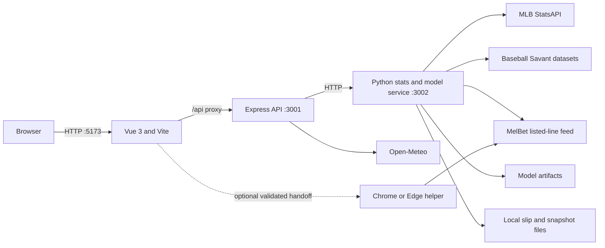

# NINTH

NINTH is a responsive, market-free MLB decision workspace. It combines official schedules, live scores, standings, rosters, player profiles, matchup context, weather, personal slip tracking, and a transparent moneyline prediction model in one application.

The model estimates which team is more likely to win outright. Sportsbook prices and bookmaker odds are intentionally excluded from production training and inference. NINTH is decision-support software, not a guarantee of results.

## Contents

- [Product scope](#product-scope)
- [Architecture](#architecture)
- [Technology](#technology)
- [Data sources](#data-sources)
- [Local setup](#local-setup)
- [Configuration](#configuration)
- [Commands](#commands)
- [Application pages](#application-pages)
- [API reference](#api-reference)
- [Prediction model](#prediction-model)
- [Projection lifecycle](#projection-lifecycle)
- [Slip Builder](#slip-builder)
- [MelBet browser helper](#melbet-browser-helper)
- [PDF slip tracking](#pdf-slip-tracking)
- [Persistence and multi-user readiness](#persistence-and-multi-user-readiness)
- [Performance and reliability](#performance-and-reliability)
- [Testing](#testing)
- [Production deployment](#production-deployment)
- [Project structure](#project-structure)
- [Known limitations](#known-limitations)
- [Troubleshooting](#troubleshooting)
- [Attribution and responsible use](#attribution-and-responsible-use)

## Product scope

NINTH currently provides:

- A home dashboard with the live slate, best records, and a dynamically selected model brief.
- Daily MLB schedules with date navigation, team filters, probable pitchers, venues, and progressively loaded weather.
- A live center showing every game currently in progress.
- Live game views with scores, inning state, counts, official box-score statistics, batter plate appearances, pitcher workload, play-by-play, and live-adjusted projections.
- Matchup pages with moneyline projections, confidence, input coverage, strongest model contributors, starting pitchers, official personnel, recent team form, and season comparisons.
- Overall, AL, NL, and divisional standings.
- All 30 team pages with current records and complete active rosters grouped into rotation, bullpen, starting lineup, and bench roles.
- An active-player directory and individual player profiles with official headshots and season statistics.
- Global search across teams, players, and nearby games.
- A daily or multi-day builder with Moneyline, Totals, and Mixed modes, adjustable leg counts, current listed thresholds, and market-aware all-correct estimates.
- A dedicated Player Props builder with game-first selection, pitcher/batter filters, prop-type multi-select, Over/Under/Both recommendations, and calibrated probabilities.
- An optional unpacked Chrome/Edge helper that revalidates and transfers exact Moneyline, Totals, Mixed, and Player Props cards without entering a stake or submitting a wager.
- Personal PDF slip import, matching, result tracking, alerts, pagination, and chronological archives.
- A Model Lab exposing walk-forward evaluation, selective accuracy, feature groups, parlay hit rates, and dated/paginated completed records for all three model families.
- Light and dark themes, responsive layouts, custom selects and calendars, loading states, empty states, and recoverable provider errors.

No placeholder games, simulated prices, fake players, or mock projections are intentionally displayed. Missing provider data is represented as pending, unavailable, or unconfirmed.

## Architecture

NINTH runs as three local services during development:



### Service responsibilities

| Service | Default address | Responsibility |
|---|---|---|
| Vue/Vite client | `http://localhost:5173` | Routing, responsive UI, local builder state, polling, loading and error recovery |
| Express API | `http://localhost:3001` | Public API boundary, response normalization, caching, weather coordination, optional odds adapter |
| Python stats service | `http://127.0.0.1:3002` | MLB data access, model inference, projection monitoring, snapshots, slip parsing, maintenance and training integration |

The Vite development server proxies `/api` to Express. Express then communicates with the Python service over localhost.

## Technology

### Frontend

- Vue 3
- Vue Router
- Pinia
- Vite
- Chart.js and vue-chartjs
- Lucide icons
- Custom responsive CSS with light and dark design tokens

### Backend

- Node.js and Express
- Python 3
- `MLB-StatsAPI`
- Requests
- NumPy
- scikit-learn
- LightGBM
- Joblib
- pypdf

### Machine learning

- Leakage-safe chronological feature construction
- Walk-forward season evaluation
- Calibrated moneyline, total-runs distribution, and player-prop threshold models
- LightGBM, negative-binomial/Poisson count distributions, and monotone probability calibration
- Prior-start Baseball Savant/Statcast starter aggregates
- Candidate-versus-incumbent promotion gates

## Data sources

| Data | Source | Notes |
|---|---|---|
| Schedules, game states, scores, standings, rosters, season stats, box scores and play-by-play | [MLB StatsAPI](https://github.com/toddrob99/MLB-StatsAPI) | Accessed through the Python adapter |
| Team logos and player headshots | MLB static image services | Components fall back to abbreviations or initials when an image fails |
| Game-time forecasts | [Open-Meteo](https://open-meteo.com/) | Loaded progressively and cached; historical endpoint is used for older games |
| Pitch-level starter history | [Baseball Savant](https://baseballsavant.mlb.com/) | Collected as compact prior-game aggregates; raw pitch downloads are discarded |
| Optional sportsbook adapter | [The Odds API](https://the-odds-api.com/) | Not used by the production model; no simulated odds are shown without a key |
| Currently listed builder markets | MelBet line feed | Event IDs, totals thresholds, player-prop thresholds, and decimal odds try `mel-bet.et` first and automatically retry through `melbet-322491.top`; odds are display/filter metadata only and never model inputs |

The health endpoint includes `syntheticData: false` so provider status can be audited directly.

## Local setup

### Prerequisites

- Node.js 20 LTS or newer is recommended.
- npm.
- Python 3.10 or newer.
- Network access to MLB and Open-Meteo endpoints.
- A trained `ml/artifacts/moneyline.joblib` and matching `ml/artifacts/report.json` for predictions. These artifacts are ignored by Git and must be trained or transferred separately on a new machine.

### Installation

From the project root:

```powershell
npm install
python -m pip install -r stats-service/requirements.txt
Copy-Item .env.example .env
```

On macOS or Linux, replace the last command with:

```bash
cp .env.example .env
```

### Start the normal daily stack

The daily profile builds the client once, serves the production bundle without
watching the repository, and starts the API/model services without Node watch
mode:

```powershell
npm run daily
```

Reserve the full watch stack for active coding:

```powershell
npm run dev
```

Open `http://localhost:5173`.

Expected listeners:

- `5173`: Vite client
- `3001`: Express API
- `3002`: Python MLB/model service

Verify the stack with:

```powershell
Invoke-RestMethod http://127.0.0.1:3001/api/health
```

or:

```bash
curl http://127.0.0.1:3001/api/health
```

## Configuration

The Node process reads `.env` from the project root through `dotenv`. The Python service reads the same inherited environment when started through npm.

| Variable | Default | Purpose |
|---|---:|---|
| `PORT` | `3001` | Express API port |
| `MLB_STATS_URL` | `http://127.0.0.1:3002` | Python service URL used by Express |
| `MLB_STATS_PORT` | `3002` | Python service port |
| `NINTH_PROJECTION_MONITOR_ENABLED` | `1` | Enable background pregame/live projection monitoring |
| `NINTH_PREGAME_REFRESH_SECONDS` | `300` | Background pregame reassessment interval; minimum 60 seconds |
| `NINTH_LIVE_REFRESH_SECONDS` | `10` | Background live reassessment interval; minimum 5 seconds |
| `NINTH_GAME_DISCOVERY_SECONDS` | `60` | How often the monitor discovers upcoming/live games |
| `NINTH_PREGAME_MONITOR_HOURS` | `24` | Pregame monitoring horizon |
| `NINTH_PLAYER_PROP_REFRESH_SECONDS` | `300` | Normal player-prop archive cadence; automatically tightens near first pitch |
| `NINTH_MELBET_REFRESH_SECONDS` | `300` | Normal MelBet market polling interval |
| `NINTH_MELBET_NEAR_START_SECONDS` | `60` | MelBet interval inside the near-first-pitch window |
| `NINTH_MELBET_NEAR_START_MINUTES` | `30` | Minutes before first pitch when tighter polling begins |
| `NINTH_MELBET_MAX_BACKOFF_SECONDS` | `1800` | Maximum MelBet failure backoff |
| `NINTH_SLIP_TIMEZONE_OFFSET_HOURS` | `3` | Time-zone offset used to interpret printed slip timestamps |
| `NINTH_MAINTENANCE_ENABLED` | `1` | Enable guarded model/data maintenance checks |
| `NINTH_MAINTENANCE_HOUR` / `NINTH_MAINTENANCE_MINUTE` | `3` / `15` | Local nightly maintenance time; maintenance does not run at startup |
| `NINTH_READINESS_HOUR` / `NINTH_READINESS_MINUTE` | `3` / `45` | Local nightly NFL/Football readiness refresh time; results under six hours old are skipped |
| `NINTH_ENRICH_WORKERS` | `6` | Worker count for scheduled context enrichment |
| `NINTH_RETRAIN_GAME_THRESHOLD` | `100` | Retrain after this many new completed games |
| `NINTH_RETRAIN_DAYS` | `7` | Maximum age before retraining when new games exist |
| `NINTH_ARTIFACT_DIR` | `ml/artifacts` | Alternate output directory used during candidate training |
| `THE_ODDS_API_KEY` | empty | Optional odds-provider key; not required by the production application or model |
| `ODDS_REGION` | `us` | Optional odds region |
| `ODDS_FORMAT` | `american` | Optional odds format |

Example `.env`:

```dotenv
PORT=3001
MLB_STATS_URL=http://127.0.0.1:3002
MLB_STATS_PORT=3002

NINTH_PROJECTION_MONITOR_ENABLED=1
NINTH_PREGAME_REFRESH_SECONDS=300
NINTH_LIVE_REFRESH_SECONDS=10
NINTH_GAME_DISCOVERY_SECONDS=60
NINTH_PREGAME_MONITOR_HOURS=24
NINTH_PLAYER_PROP_REFRESH_SECONDS=300
NINTH_MELBET_REFRESH_SECONDS=300
NINTH_MELBET_NEAR_START_SECONDS=60
NINTH_MELBET_NEAR_START_MINUTES=30
NINTH_MELBET_MAX_BACKOFF_SECONDS=1800
NINTH_SLIP_TIMEZONE_OFFSET_HOURS=3

NINTH_MAINTENANCE_ENABLED=1
NINTH_MAINTENANCE_HOUR=3
NINTH_MAINTENANCE_MINUTE=15
NINTH_READINESS_HOUR=3
NINTH_READINESS_MINUTE=45
NINTH_ENRICH_WORKERS=6
NINTH_PLAYER_PROP_WORKERS=12
NINTH_RETRAIN_GAME_THRESHOLD=100
NINTH_RETRAIN_DAYS=7

THE_ODDS_API_KEY=
ODDS_REGION=us
ODDS_FORMAT=american
```

Do not commit `.env` or provider secrets.

## Commands

| Command | Description |
|---|---|
| `npm run daily` | Build once and start the resource-aware daily stack |
| `npm start` | Serve the existing production client build with Python and Express |
| `npm run dev` | Start Python, Express in watch mode, and Vite for active coding only |
| `npm run dev:client` | Start only Vite on port 5173 |
| `npm run dev:server` | Start only Express in watch mode |
| `npm run dev:stats` | Start only the Python service |
| `npm run build` | Build the Vue client into `dist/` |
| `npm run preview` | Preview the production client build |

### Model-data commands

```powershell
# Collect completed official games
python ml/collect.py --start-season 2018 --end-season 2026

# Add point-in-time starters, lineups, bullpen usage and weather
python ml/enrich.py --start-season 2018 --end-season 2026 --workers 12

# Collect resumable Baseball Savant starter aggregates
python ml/statcast_collect.py --start 2018-03-01 --end 2026-07-14

# Train and evaluate the moneyline model
python -m ml.train_v3

# Train and audit the promoted total-runs distribution model
python -m ml.train_totals_v5

# Compare guarded Poisson, negative-binomial, direct, and boosted totals candidates
python -m ml.tune_totals_v4

# Collect official player outcomes (resumable), then train prop models
python ml/collect_player_boxscores.py --workers 12
python -m ml.train_player_props

# Audit immutable pregame prop snapshots and exact historically listed lines
python -m ml.evaluate_live_prop_snapshots
python -m ml.evaluate_observed_prop_lines ml/artifacts/player_props.joblib

# Inventory every currently listed MelBet player-market shape and aggregate decimal-odds coverage
python ml/audit_melbet_player_markets.py

# Rebuild market-specific daily and multi-day card calibration
python -m ml.calibrate_market_slips

# Re-run the guarded moneyline-v5 research comparison
python -m ml.tune_moneyline_v5

# Run the guarded maintenance workflow once
python -m ml.maintenance --once

# Inspect maintenance without changing data or artifacts
python -m ml.maintenance --once --dry-run
```

Large collection jobs are resumable where manifests are available. Review provider load and rate limits before increasing worker counts.

## Application pages

| Route | Screen |
|---|---|
| `/` | Home dashboard and model brief |
| `/schedule` | Date-driven MLB schedule |
| `/live` | All games currently live |
| `/live/:id` | Live game center |
| `/games/:id` | Matchup analysis |
| `/builder` | Daily and multi-day Moneyline, Totals, and Mixed builder |
| `/props-builder` | Daily and multi-day Player Props builder |
| `/standings` | Overall, AL, NL and divisional standings |
| `/teams` | Team directory |
| `/teams/:id` | Team room and active roster |
| `/players` | Active-player directory |
| `/players/:id` | Player profile |
| `/model` | Moneyline, totals, and player-prop evaluation with daily/overall ledgers |
| `/slips` | Imported personal slips |
| `/search?q=...` | Full search results |

The `/betting` legacy route redirects to `/model`.

## API reference

All public application endpoints are mounted under `/api` on the Express service.

### System and dashboard

| Method | Endpoint | Description |
|---|---|---|
| `GET` | `/api/health` | Service, provider, maintenance and projection-monitor status |
| `GET` | `/api/dashboard` | Home slate, featured matchup, metrics and standings leaders |
| `GET` | `/api/model` | Current moneyline, totals, and player-prop model reports |
| `GET` | `/api/model/results?market=moneyline|totals|player_props&date=YYYY-MM-DD&page=N&page_size=N&prop_types=...` | Dated and paginated completed-prediction ledger; player props support a comma-separated type filter |

### Games and projections

| Method | Endpoint | Description |
|---|---|---|
| `GET` | `/api/projection-board?start_date=YYYY-MM-DD&days=N` | Upcoming projection board; `days` is capped at 14 |
| `GET` | `/api/player-props?start_date=YYYY-MM-DD&days=N&refresh=1` | Calibrated batter and starter prop board; `days` is capped at 7 and `refresh=1` requests a current listed-line refresh |
| `GET` | `/api/games/today?date=YYYY-MM-DD` | Games for a date |
| `GET` | `/api/games/live?date=YYYY-MM-DD` | Live games for a date |
| `GET` | `/api/games/completed?date=YYYY-MM-DD` | Completed games for a date |
| `GET` | `/api/games/:id/summary` | Fast official matchup shell |
| `GET` | `/api/games/:id` | Full matchup, model context and personnel |
| `GET` | `/api/games/:id/live` | Live game state, box score, plays and projection |

### Teams, players and discovery

| Method | Endpoint | Description |
|---|---|---|
| `GET` | `/api/teams` | All MLB teams and records |
| `GET` | `/api/teams/:id` | Team profile and active roster |
| `GET` | `/api/players` | Active-player directory |
| `GET` | `/api/players/:id` | Player profile and season statistics |
| `GET` | `/api/search?q=term` | Teams, players and nearby games |
| `GET` | `/api/trends` | Official trend summaries |
| `GET` | `/api/rankings` | Official ranking summaries |
| `GET` | `/api/injuries` | Explicit provider-unavailable response when no official source is configured |

### Slips

| Method | Endpoint | Description |
|---|---|---|
| `GET` | `/api/slips` | Enriched slips, newest first |
| `POST` | `/api/slips/import` | Import `{ filename, data }`, where `data` is a base64 PDF data URL |

Provider errors are returned as JSON with an `error` field. The browser client applies an eight-second timeout, retries one failed GET, and exposes recoverable error states instead of waiting forever.

## Prediction model

### Objective

The production model estimates:

```text
P(home team wins)
P(away team wins) = 1 - P(home team wins)
```

The moneyline artifact predicts the straight-up winner. A separate totals artifact forecasts game-run thresholds. Sportsbook prices, public betting percentages, and implied probabilities are excluded from both models.

### Current artifact

The local artifact at the time this README was generated reports:

| Metric | Value |
|---|---:|
| Model | `v6_multiseason_lineup_talent` |
| Status | Promoted |
| Deployment training games | 19,457 |
| Trained through | 2026-07-28 |
| Walk-forward games | 11,294 |
| Walk-forward accuracy | 57.47% |
| Walk-forward Brier score | 0.24146 |
| Qualified accuracy | 63.47% |
| Qualified coverage | 37.15% |
| Recent 2024–2026 outer accuracy | 56.66% |
| Recent outer Brier score | 0.24303 |

These values belong to the current local `report.json`; they will change after a promoted retrain. They are historical evaluation results, not promised future accuracy.

Version 6 retains the conservative margin/nonlinear blend and prior-season team strength, then adds point-in-time, partially pooled multi-season hitter talent for the submitted batting order. It carries career signal through the offseason with shrinkage, weights lineup position, and remains neutral when an official lineup is unavailable. Against the previous production artifact, the locked 2025–2026 audit improved from 0.24371 to 0.24302 Brier; 2025 improved to 0.24189 and 2026 improved to 0.24473. Accuracy, log loss and AUC also improved in the development period and in each audit season. This is a stable forward-audit gain, not a claim that the still-aspirational sub-0.240 target has been reached.

### Total-runs distribution model

`ml/train_totals.py` builds a separate `totals.joblib`; it never alters the moneyline artifact. The model forecasts `P(total runs > line)` for 6.5 through 11.5 and recommends from the practical 7.5–10.5 decision range. Its inputs include the rolling MLB run environment, both offenses and defenses, recent game totals and volatility, learned venue scoring, starters, submitted lineups, prior-three-day bullpen workload, rest, weather, and seasonality.

Selectable sportsbook thresholds are query inputs, not training features. NINTH can score a supplied grid such as `7, 7.5, 8, 8.5, 9, 9.5, 10` from the same market-free run distribution. MelBet decimal odds are displayed and may impose a user-selected eligibility floor, but never alter expected runs or any outcome probability. Half-run lines have only over/under outcomes; integer lines expose separate over, under and push probabilities.

The training audit compares direct classifiers with Poisson and negative-binomial distributions, then calibrates the count mean into monotone threshold probabilities. Architecture selection uses rolling-origin 2022–2024 results; 2025–2026 is excluded from candidate selection and used for the final audit, although repeated prior research means it is no longer a pristine first-look holdout. Production totals v5 retains the v4 lineup-talent distribution and adds pregame-only starter workload/form plus individual-reliever quality and availability. Against a freshly replayed v4 incumbent, mean Brier improved from 0.22136 to 0.22123 in development, from 0.22264 to 0.22231 in 2025, and from 0.22181 to 0.22155 in 2026; binary log loss also improved in both audit seasons. The pooled 2025–2026 Brier gain was 0.000303 (game-bootstrap 95% interval 0.000078 to 0.000530). These are forecasting metrics, not profitability claims, because the system has no price or payout input.

### Player-prop probability models

`ml/train_player_props.py` replays official player box scores chronologically and trains separate batter and starting-pitcher threshold models. Batter targets include hits, total bases, home runs, runs, RBIs, walks, strikeouts, doubles and stolen bases. Pitcher targets include strikeouts, outs, walks, hits allowed, earned runs, home runs allowed and pitches thrown.

Each model combines empirical-Bayes player form, recent and season opportunity volume, per-opportunity rates, opponent team tendencies, projected or confirmed batting order, probable starter history, handedness splits, and prior-game Statcast xwOBA, hard-hit, barrel, whiff and velocity signals. Pitcher forecasts also aggregate the confirmed opposing lineup's point-in-time hit, strikeout, walk and home-run tendencies. Direct LightGBM threshold probabilities are calibrated on 2024 only. Count-distribution heads were tested for pitcher strikeouts and outs, but were not deployed because the exact listed-line audit rejected them. The final report is reserved for 2025–2026 and includes Brier skill against a line-specific climatology baseline so sparse outcomes cannot look strong merely by predicting the under.

The Player Lab recommends at most one prop per game and requires an audited 65% probability floor for automatic cards. Lower-confidence listed lines remain available for manual inspection but are not silently inserted by “Build Best.” This avoids presenting weak or correlated same-game legs as independent. Its displayed card confidence is the product of calibrated leg probabilities after sample-history shrinkage; it is not a sportsbook-return or profitability estimate.

Historical bullpen features are rebuilt from games preceding the prediction. The current game's final reliever usage is explicitly excluded, even though it exists in archived box scores.

### July 2026 tuning audit

The moneyline research stage was data-first rather than a wider hyperparameter search. Point-in-time multi-season lineup talent passed the promotion gate and became v6. Elo recency adaptation, partial-pooling team run models and wider blends were rejected because they regressed 2026 or failed to improve both audit seasons. Starter workload, velocity movement and reliever-level availability were subsequently tested: the development-selected bullpen candidate worsened pooled 2025–2026 Brier by 0.000021, so moneyline v6 was retained. Remaining research targets include defensive run value and explicit travel distance and time-zone change. Candidates must still beat the incumbent in aggregate and season-by-season forward tests before promotion.

Moneyline tuning also tested beta calibration, categorical team/personnel effects, score-distribution forecasts, bullpen quality and constrained ensembles. Those candidates either regressed later seasons or could not be reproduced from live inputs. Explicit prior-season strength from v5 remains in v6, and multi-season lineup talent is the only new component promoted in this cycle. The requested sub-0.240 audit target was not reached and is not claimed.

The totals cycle tested game-varying dispersion, beta calibration, isotonic distribution maps, direct threshold models, partial-pooling team run counts and rolling Statcast contact quality. Production v5 uses only components reproducible from pregame inputs: a negative-binomial count distribution, monotone mean calibration, direct thresholds, prior-season run strength, partially pooled lineup talent, starter workload/form, and individual bullpen availability. Historical bullpen membership is inferred only from prior relief appearances; the current game's eventual relievers are never exposed to a forecast. More aggressive variants remain shadow-only when they fail a separate-season gate.

The player-prop cycle evaluated 16 prop markets over 2,200,113 chronological threshold observations and separately replayed 3,193 immutable MelBet listed-line selections. Only the new direct pitcher-strikeout model passed the aggregate, 2025, 2026 and exact-line gates, so the production v3 artifact is deliberately hybrid: pitcher strikeouts use the new confirmed-opponent-lineup feature set while the other 15 markets retain their stronger incumbent models. On exact listed lines, Brier improved from 0.19706 to 0.19694 and side accuracy from 67.74% to 67.80%. Within pitcher strikeouts, exact-line Brier improved from 0.24311 to 0.23941 and accuracy from 56.19% to 58.10%. The broader all-threshold Brier moved from 0.121793 to 0.121776; the small family-wide change is expected because only one market was promoted.

The research design is informed by MLB's definitions of [xwOBA](https://www.mlb.com/glossary/statcast/expected-woba) and [xERA](https://www.mlb.com/glossary/statcast/expected-era), [empirical-Bayes shrinkage for baseball rates](https://arxiv.org/abs/0803.3697), [beta calibration](https://proceedings.mlr.press/v54/kull17a.html), and hierarchical count modeling. External ideas are treated as hypotheses only: every implementation must remain reproducible from pregame data and pass NINTH's chronological promotion gates.

### Model Lab records

The Model Lab separates the performance of each prediction family instead of combining unlike targets:

- **Moneyline:** original archived pregame pick, probability, actual winner, correct/incorrect result, daily summary, overall record, and 2-8 leg card hit rates.
- **Totals:** archived listed line and Over/Under recommendation, final runs, push handling, daily summary, and paginated overall record.
- **Player Props:** exact archived player, prop, side, and line, official outcome, Brier score, daily and overall records, pagination, and a multi-select filter for one or more prop types.

Each ledger has its own date selector. Results come only from snapshots created before the event; opening the Model Lab or a builder is not required to create the current archive. The player-prop monitor refreshes every 60 seconds by default, and the main projection monitor reassesses pregame games every 60 seconds and live games every 10 seconds.

### Feature groups

The deployed moneyline artifact contains 44 market-free features:

**Team strength and form**

- Long-term Elo difference, including the learned home-field offset.
- Last-5, last-10 and last-20 win-rate differences.
- Last-10 and last-20 scoring-margin differences.
- Rolling runs scored and rolling run-prevention differences.
- Season winning percentage.
- Pythagorean expected winning percentage.
- Home/road splits and rest differences.

**Starting pitching**

- Starter Elo and rest.
- ERA and WHIP differences.
- Prior-15-start expected wOBA, hard-hit, barrel, whiff, K/BB and velocity advantages.
- Joint Statcast reliability and starter-history depth.

**Matchup context**

- Submitted-lineup OPS difference.
- Partially pooled multi-season lineup wOBA, top-four quality, depth, power and discipline differences.
- Joint lineup-history reliability so sparse orders are pulled toward neutral.
- Bullpen pitches over the previous three days.
- Temperature and wind.
- Context-availability indicator.

Features are constructed using only information available before each historical game. A completed result is applied to team state only after that game's training row is generated.

### Training and calibration

1. Official completed games are processed chronologically.
2. Pregame features are created from prior team and starter history.
3. A capped run-margin model learns game strength without allowing extreme blowouts to dominate the target.
4. The predicted margin is calibrated into a home-win probability.
5. Walk-forward seasons test the model only on later, unseen games.
6. An isotonic confidence model estimates historical hit rate for similarly decisive predictions.
7. Missing confirmed inputs reduce confidence without being presented as certainty.

The confidence score is not the same as win probability. A team can have a 56% win probability while the model confidence remains low because starters, lineups or bullpens are unconfirmed.

### Explanation values

Matchup explanations are counterfactual, not causal. For each feature, NINTH compares the full prediction with a version in which that one feature is set to a neutral value. Because the model is nonlinear, feature impacts do not necessarily add exactly to the displayed probability and may interact with other signals.

The matchup UI shows the four strongest material contributors. The model page lists all deployed signals.

### Promotion safeguards

Maintenance trains moneyline, totals, and player-prop artifacts into a candidate
directory. Each model family promotes independently only if its own gates pass.
Moneyline gates include:

- New completed games are present.
- Walk-forward accuracy is at least 57%.
- Qualified accuracy is at least 60%.
- Walk-forward Brier score does not materially regress.
- Recent accuracy remains within the allowed stability margin.
- Recent Brier score remains within the allowed stability margin.

A failed candidate is deleted and cannot replace the incumbent artifact. This is intended to reduce overfitting and accidental degradation.

Totals promotion separately requires new completed games, positive unseen Brier skill versus climatology, no material regression in the locked 2025–2026 Brier audit, and an acceptable selected-line Brier score.

Player-prop promotion is artifact-wide and guarded. It requires every deployed
prop model to be present, positive aggregate Brier skill, lower sample-weighted
2025–2026 Brier score, stable side accuracy, and no individual prop Brier
or individual-season regression greater than 0.00001. Nightly maintenance syncs official player box
scores before creating the candidate. MelBet is audited only for currently
selectable market types and exact thresholds; its prices are never training
features or retained in the audit.

## Projection lifecycle

### Background updates

Projection refresh does not depend on a matchup page being open.

- Upcoming games are discovered every 30 seconds by default.
- Games inside the 24-hour monitoring window are reassessed every 60 seconds.
- Live games are reassessed every 10 seconds.
- Provider failures retry without overwriting a valid archived forecast.
- Final games stop live polling.

### Input status

- A starter is **predicted** when MLB lists a probable pitcher.
- A starter becomes **confirmed** only when that pitcher matches the first pitcher on the submitted official game roster.
- A lineup becomes confirmed after a nine-player batting order is submitted.
- A bullpen becomes confirmed after the official pitcher pool is available.
- Weather is supplied by the MLB game feed when available, otherwise Open-Meteo.

Input completeness is weighted as follows:

| Input | Weight |
|---|---:|
| Both starters present | 15% |
| Both starters confirmed | 10% |
| Both lineups confirmed | 30% |
| Bullpen workload available | 15% |
| Both bullpens confirmed | 10% |
| Weather available | 20% |

### Pregame snapshots and final audits

Projection snapshots are written separately from the live UI. Once a game starts, the pre-first-pitch forecast is preserved for evaluation. A final result cannot rewrite the original prediction.

Finished games show:

- Original model pick.
- Archived pregame probability.
- Actual winner.
- Whether the pick was correct.

The Model Lab ledger includes only games with a valid snapshot recorded before first pitch.

### Live adjustment

During a game, NINTH combines the archived pregame prior with official:

- Score differential.
- Inning and half-inning.
- Outs.
- Baserunner state.
- Remaining-game leverage.

Live-adjusted results are tracked separately from pregame model accuracy until sufficient forward validation exists.

## Slip Builder

The builder is market-free and supports:

- Daily mode.
- Multi-day range selection up to 14 days.
- Adjustable targets from 2 to 10 legs.
- Moneyline, total-runs, and mixed model modes.
- Manual home/away moneyline or higher/lower selections at the model-selected total.
- Recommended cards built from the highest projected eligible probability.
- Exactly one selection per game; moneyline and total cannot coexist for one matchup.
- Automatic totals recommendations use the exact balanced central MelBet line;
  they never shift to the lower of two half-run neighbours. Integer-line ties are
  retained as pushes instead of being relabelled as wins or losses.
- A totals leg is automatic only when its exact line and side passed the
  chronological promotion gate and the calibrated probability, forecast-run
  distribution, and frozen empirical-residual estimate all agree. Otherwise the
  model abstains while leaving listed lines available for manual selection.
- Recommended totals cards cap repeated exact line/side exposure at two legs on
  2–5 leg cards and three legs on larger cards. They do not manufacture Over/Under
  balance by forcing a weaker side into the card.
- A combined all-correct estimate.
- Input-completeness adjustments.
- Historical calibration only where a validation cell passed its promotion gate.
- Current MelBet event IDs, listed totals thresholds, and decimal odds; odds remain isolated from inference and are used only for display and the optional minimum-odds rail.

The raw joint probability is the product of the selected leg probabilities; probabilities are never added. NINTH then reduces each leg's distance from 50% when that leg's official model inputs are missing. Moneyline, totals and mixed cards each use a separate chronological card calibration. An adjustment is applied only when the exact market, daily/multi-day horizon and 2-8 leg cell improved Brier score on the 2025-2026 forward audit and passed separate-season stability checks. Rejected or sparse cells retain the multiplicative model estimate.

`python -m ml.calibrate_market_slips` regenerates `ml/artifacts/market_slip_calibration.json` from rolling-origin out-of-fold game probabilities. Automatic model maintenance regenerates this artifact after training, so a totals leg is evaluated with the totals model and a mixed card preserves the actual market selected for every game.

Backtest calibration currently targets 2–8 leg cards. Nine- and ten-leg cards are displayed as extended, input-adjusted estimates.

Builder selections and settings are stored in browser `localStorage`. The saved draft expires after 15 minutes without visiting the builder. Opening a matchup from the builder preserves the draft and provides context-aware return navigation.

### NFL model and builder

`/american-football/builder` is a separate NFL-native construction surface.
It reads nflverse schedules and play-by-play, presents current moneyline, spread
and total anchors, and enforces one selection per game. Prices and lines are not
model features: lines are applied only after the forecast as decision thresholds.

- NFL moneyline has passed the multi-season chronological historical gate and
  remains automatic-only locked until 30 immutable live observations also pass
  the Brier gate.
- Spread and totals are generated by a joint expected-total/home-margin score
  distribution. They remain shadow-only because the untouched line-aware audit
  did not beat the no-skill Brier baseline.
- The nightly multisport job rebuilds `score.jsonl`, trains the joint score
  artifact, regenerates upcoming predictions, and settles the pregame live ledger.
- The Builder exposes Shadow and Automatic evidence modes; research cards never
  call MelBet Autofill and never place a wager.

The separate Player Props builder uses the same Daily/Multi-day controls and target-leg behavior. It shows games first, then opens an in-page player market panel. Users can filter prop families, restrict automatic recommendations to Over, Under, or Both, and select only exact thresholds currently present in the listed-line feed. The target is capped by the eligible games because NINTH permits at most one recommended player-prop leg per game.

## MelBet browser helper

`melbet-helper/` contains the optional **NINTH MelBet Helper v0.8.0**, an unpacked Manifest V3 extension for Chrome and Edge. It supports Moneyline, Totals, Mixed, and Player Props cards.

To install it locally:

1. Open `chrome://extensions` or `edge://extensions`.
2. Enable **Developer mode**.
3. Choose **Load unpacked** and select the repository's `melbet-helper` folder.
4. Build a card in NINTH, open **Send to MelBet**, and choose **Autofill all**.
5. Keep the MelBet tab visible while canvas-rendered totals or player props are being selected.

The transfer strategy depends on the market:

- **Moneyline:** batches selections on the single MLB board, matches the exact event ID, both team names, and `W1`/`W2`, and confirms MelBet's selected-button state before advancing.
- **Totals:** opens each event and matches only `Regular time -> Total`, the exact Over/Under side, and the exact paired threshold.
- **Mixed:** completes the batched moneylines first, then visits the required totals events.
- **Player Props:** matches the event, player, prop family, side, and threshold, isolates the market with MelBet's search, and validates the visible canvas click point.

The helper tries `mel-bet.et` first and keeps the same session on `melbet-322491.top` if the primary market fails to render. It checks the signed-in state before each selection and performs one recovery refresh when MelBet initially forgets the session. Failed confirmations use a guarded retry of up to three attempts; before retrying, the helper checks whether the delayed click already added the leg so it cannot toggle a successful selection back off. Debugger-driven canvas operations have hard timeouts, while moneylines use normal DOM controls.

Handoffs expire after 15 minutes and live only in `chrome.storage.session`. Reload the unpacked extension after pulling helper changes; it refreshes open local NINTH and active handoff tabs so the bridge is reinjected. The helper never reads credentials, enters a stake, presses a confirmation control, or submits a wager. Always review the resulting betslip manually. The bundled manifest connects to NINTH on `localhost` and `127.0.0.1`; add the deployed NINTH origin to `manifest.json` before using it from a VPS-hosted frontend. See `melbet-helper/README.md` for the full safety contract.

## PDF slip tracking

The current parser supports text-based MelBet-style MLB moneyline PDFs containing `W1` or `W2` selections and full-game `Total Over (line)` / `Total Under (line)` selections. Moneyline and totals legs may coexist in one PDF. Total legs settle from the official combined final score, with an exact integer-line result recorded as void.

Import behavior:

- PDFs are validated in the browser and limited to 9 MB.
- Scanned images without selectable text are rejected.
- Encrypted, damaged, unsupported, and non-PDF files return explicit errors.
- Slip number, printed timestamp, stake, overall odds, potential return and individual legs are extracted when present.
- Teams are matched to official MLB games.
- Printed date/time and scheduled start time are used to distinguish consecutive-day matchups and doubleheaders.
- A postponed ticketed game is voided instead of being silently moved to a later replacement game.
- Active selections receive projection and circumstance alerts.
- Active slips open by default; completed slips remain collapsed.
- Slips are sorted newest first and paginated six per page.

The parser is layout-specific. A materially different PDF format requires a new parser or parsing strategy.

## Persistence and multi-user readiness

### Current persistence

This repository currently uses filesystem persistence:

| Data | Location |
|---|---|
| Completed training games | `ml/data/games.jsonl` |
| Historical contexts | `ml/data/contexts*.jsonl` |
| Statcast aggregates and manifests | `ml/data/statcast_*.jsonl`, `ml/data/*_days.txt` |
| Pregame/live moneyline and totals snapshots | `ml/data/projection_snapshots.jsonl` |
| Exact player-prop recommendation snapshots | `ml/data/player_prop_projection_snapshots.jsonl` |
| Observed MelBet totals-line snapshots | `ml/data/melbet_totals_snapshots.jsonl` |
| Imported slips | `ml/data/slips.json` |
| Production models | `ml/artifacts/moneyline.joblib`, `totals.joblib`, `player_props.joblib` |
| Reports, card calibration, and maintenance state | `ml/artifacts/report.json`, `totals_report.json`, `player_props_report.json`, `market_slip_calibration.json`, `maintenance_state.json` |
| Builder drafts | Browser `localStorage`, with a 15-minute inactivity expiry |
| Helper handoff | `chrome.storage.session`, with a 15-minute expiry |

There is currently no application database, user account system, session management, or per-user data isolation.

### Required before multi-user VPS launch

The present slip store is shared by every visitor and is not safe for a public multi-user deployment. Before launch, add:

- PostgreSQL for users, slips, slip legs, alerts, projection snapshots and audit events.
- Authentication and secure sessions.
- User ownership checks on every slip and alert endpoint.
- Database migrations, backups and retention policies.
- Object storage only if original PDFs must be retained. The current parser does not need to persist the PDF after extraction.
- A background job queue for imports, alerts and maintenance.
- Rate limiting, request logging, CSRF protections where applicable, and hardened upload validation.
- HTTPS and secret management.
- Separate read-only model artifacts from mutable user data.

Model datasets may remain file-based for offline research, but operational multi-user state should move to a transactional database.

## Performance and reliability

Several paths are intentionally progressive:

- The schedule returns official games first and merges cached Open-Meteo forecasts afterward.
- Projection boards return real baseline predictions first and enrich nearby matchups with starters, lineups, bullpens and weather in the background.
- MelBet listed-line requests use a primary/proxy fallback and short-lived caches; decimal odds are retained only as transient display/filter metadata.
- The player-prop archive refreshes in the background, so opening the builder is not required to record the day's exact recommendations.
- Pitcher profiles and recent team form are cached.
- Team and player directory requests are cached by the server adapter.
- Duplicate browser GET requests share one in-flight promise.
- Browser GET requests time out after eight seconds and retry once.
- A failed background dashboard refresh no longer removes the active page.
- Route changes create clean component instances, and rapid matchup changes queue the latest destination.

Typical local targets are:

- Cold schedule: under 1.5 seconds.
- Cached schedule: under 300 ms.
- Usable daily projection board: under 3 seconds.
- Full nearby matchup context: under roughly 8 seconds, without blocking the baseline board.

Provider latency and rate limits can still affect cold loads.

## Testing

### Production client build

```powershell
npm run build
```

### Projection integrity tests

```powershell
python -m unittest stats-service/test_projection_integrity.py -v
```

The 30-test integrity suite currently verifies:

- Final games use the last valid snapshot recorded before first pitch.
- A final status never creates a new prediction snapshot.
- Pregame total forecasts lock before first pitch, while live totals condition on runs and remaining innings.
- Input-coverage changes are archived even when probability does not move.
- Official live score, inning and base/out state move live projections.
- Live snapshots are explicitly separated from pregame snapshots.
- Open-Meteo rate limits fall back to cooldown/stale-cache behavior instead of breaking projections.
- Slip refreshes are backgrounded and deduplicated.
- Consecutive-day games, doubleheaders, postponed games, total settlement, and integer pushes resolve correctly.
- Completed moneyline, totals, and player-prop ledgers filter, score, and paginate independently.
- MelBet primary/proxy fallbacks preserve current decimal odds plus exact event, group, side, and line matching; odds never enter model inference.
- Player-prop results void non-participants and never score an unlisted prop or threshold.

Additional focused model/parser tests:

```powershell
python -m unittest ml.test_player_props ml.test_totals ml.test_slips -v
```

### Syntax checks

```powershell
node --check server/src/services/dataService.js
python -m py_compile stats-service/app.py
```

### Manual smoke test

Verify at minimum:

1. `/api/health` returns all providers and monitor status.
2. Home renders a model brief or a clear no-upcoming-game state.
3. Schedule date changes do not require a hard refresh.
4. Team and player filters show explicit zero-result states.
5. A matchup displays the same projection as the builder.
6. Live center lists every active game before entering one.
7. Final games show the archived prediction and actual result.
8. An unsupported PDF produces a visible import error.
9. Rapid navigation between all main routes does not leave a permanent loader.

## Production deployment

`npm run build` creates static files in `dist/`. The local `npm start` daily
profile serves that bundle through Vite Preview and proxies `/api` to Express.
An internet-facing deployment should still use a static web server or CDN plus
a reverse proxy rather than Vite Preview.

### Recommended VPS layout

```text
Internet
   |
 HTTPS
   |
Nginx
   |-- /        -> project/dist
   |-- /api/*   -> 127.0.0.1:3001
                         |
                         -> 127.0.0.1:3002
```

### Build

```bash
npm ci
python3 -m venv .venv
source .venv/bin/activate
python -m pip install -r stats-service/requirements.txt
npm run build
```

Transfer or train the required model artifacts after deployment:

```text
ml/artifacts/moneyline.joblib
ml/artifacts/report.json
ml/artifacts/totals.joblib
ml/artifacts/totals_report.json
ml/artifacts/player_props.joblib
ml/artifacts/player_props_report.json
ml/artifacts/market_slip_calibration.json
ml/artifacts/maintenance_state.json
```

### Example Nginx server block

```nginx
server {
    listen 80;
    server_name ninth.example.com;

    root /srv/ninth/dist;
    index index.html;

    location /api/ {
        proxy_pass http://127.0.0.1:3001;
        proxy_http_version 1.1;
        proxy_set_header Host $host;
        proxy_set_header X-Real-IP $remote_addr;
        proxy_set_header X-Forwarded-For $proxy_add_x_forwarded_for;
        proxy_set_header X-Forwarded-Proto $scheme;
    }

    location / {
        try_files $uri $uri/ /index.html;
    }
}
```

Add TLS with the VPS provider or Certbot before exposing the application publicly.

### Process supervision

Run Express and Python as separately supervised services rather than relying on a terminal session. The working directory must be the project root so `.env`, model artifacts and data paths resolve correctly.

Example commands for a supervisor:

```bash
/usr/bin/node /srv/ninth/server/src/server.js
/srv/ninth/.venv/bin/python /srv/ninth/stats-service/app.py
```

Do not expose port 3002 publicly. Keep both backend ports behind the firewall and allow public traffic only through Nginx.

Before a multi-user release, complete the database and authentication work described above. The current filesystem slip store is suitable only for a single trusted user.

## Project structure

```text
Diamond_MLB_Analytics/
├── public/
│   └── brand/                  # NINTH logos and favicons
├── src/
│   ├── assets/                 # Global design tokens and styles
│   ├── components/
│   │   ├── charts/             # Chart.js wrappers
│   │   ├── game/               # Cards, personnel, live stats and projections
│   │   ├── layout/             # Header, navigation, search and score strip
│   │   ├── navigation/         # Context-aware back navigation
│   │   ├── player/             # MLB headshot component
│   │   ├── team/               # MLB team-logo component
│   │   └── ui/                 # Selects, calendars, loaders and empty/error states
│   ├── router/                 # Client routes
│   ├── services/               # Browser API client, timeout, retry and deduplication
│   ├── stores/                 # Pinia dashboard and theme state
│   └── views/                  # Application screens
├── server/
│   └── src/
│       ├── controllers/        # HTTP controllers
│       ├── routes/             # Express API routes
│       └── services/           # MLB adapter, weather, cache and data normalization
├── stats-service/
│   ├── app.py                  # Python API, monitors, inference and slip endpoints
│   ├── requirements.txt
│   └── test_projection_integrity.py
├── ml/
│   ├── artifacts/              # Local model, reports and experiment outputs
│   ├── data/                   # Local datasets, snapshots and slip store
│   ├── collect.py              # Completed-game collector
│   ├── enrich.py               # Historical point-in-time context enrichment
│   ├── statcast_collect.py      # Resumable Baseball Savant aggregation
│   ├── features.py             # Leakage-safe feature state
│   ├── predict.py              # Inference, confidence and explanations
│   ├── train_v3.py             # Production training pipeline
│   ├── maintenance.py          # Guarded sync, candidate training and promotion
│   └── README.md               # ML-specific workflow notes
├── .env.example
├── package.json
├── vite.config.js
└── README.md
```

The `stitch_diamond_intel_analytics/` directory contains earlier visual references and is not part of the runtime application.

Notable additions since the initial release include `melbet-helper/`; `src/components/builder/`; `src/views/PlayerPropsBuilderView.vue`; `src/components/ui/CustomMultiSelect.vue`; the totals feature/model/prediction/training modules; the player-prop collection, feature, prediction, and training modules; market-card calibration; and focused moneyline, totals, props, and slip research/test scripts under `ml/`.

Generated logs, temporary images, `node_modules/`, `dist/`, ML data, and model artifacts should not be committed.

## Known limitations

- This is currently a single-user application with no database or authentication.
- The supported slip parser is specific to text-based MelBet-style PDFs.
- MelBet exposes only a short current market window and can change or remove listed lines at any time.
- The optional helper depends on MelBet's current DOM/canvas layout. Exact validation deliberately stops the handoff when that layout or a line changes.
- The helper requires a visible MelBet tab, a restored signed-in session, and a locally loaded unpacked extension; it never completes a wager.
- Confirmed lineups generally arrive close to first pitch, so early projections intentionally have lower input coverage.
- Probable pitchers remain labeled predicted until they match the submitted official game roster.
- Bullpen workload depends on official box-score availability.
- Rogers Centre and other retractable-roof states are not yet modeled explicitly.
- Player injuries are not shown without a configured, legitimate provider.
- Weather forecasts can change and may remain pending when venue coordinates or provider responses are unavailable.
- The explanation system uses one-feature counterfactuals; nonlinear interactions can produce non-intuitive individual effects.
- Live probability adjustment requires continued forward validation and is not included in pregame accuracy.
- Player-prop history is limited to outcomes reproducible from official MLB box scores and the supported listed prop families.
- An odds-provider adapter exists, but sportsbook information is not required and is excluded from the trained model.
- A 57–62% historical evaluation result still implies many incorrect individual predictions.

## Troubleshooting

### A page remains on a loader

The browser client times out and retries GET requests automatically. If both attempts fail, use the visible **Try again** control and check:

```powershell
Get-NetTCPConnection -State Listen | Where-Object {$_.LocalPort -in 5173,3001,3002}
Invoke-RestMethod http://127.0.0.1:3001/api/health
```

Also inspect `server.err.log`, `vite.err.log`, and `stats-service/app.err.log` when running with redirected logs.

### Express cannot reach the Python service

Confirm `MLB_STATS_URL` matches `MLB_STATS_PORT`, then start the Python service:

```powershell
npm run dev:stats
```

### The model is unavailable

Confirm both files exist and were produced by the same training run:

```text
ml/artifacts/moneyline.joblib
ml/artifacts/report.json
```

Run `python -m ml.train_v3` only after the required historical datasets have been collected and enriched.

### The projection is stale

Check `/api/health` for:

- `projection_monitor.running`
- `projection_monitor.last_discovery_at`
- `projection_monitor.last_refresh_at`
- `projection_monitor.last_error`

Also confirm `NINTH_PROJECTION_MONITOR_ENABLED=1`.

### A PDF cannot be imported

Confirm that it:

- Is under 9 MB.
- Contains selectable text.
- Is not encrypted.
- Contains recognizable MLB moneyline rows with `W1`/`W2` and/or full-game `Total Over (line)` / `Total Under (line)` rows.
- Uses the supported MelBet-style layout.

### The MelBet helper is not detected or stalls

Open the browser's extensions page, reload **NINTH MelBet Helper**, and refresh the NINTH tab. Keep the active MelBet event visible while totals or player props are processed. Confirm that MelBet shows the signed-in account state; the helper performs one recovery reload but stops if Registration/Login remains visible. If the primary site does not render, allow the automatic proxy fallback. A changed event, market, side, or threshold is a safe stop and must be rebuilt from current lines in NINTH.

### Weather remains pending

Official games still render without weather. Confirm internet access to Open-Meteo and verify that the MLB venue includes coordinates. Weather is deliberately non-blocking.

### The production site returns 404 after refreshing a route

Configure the static server to fall back to `index.html`. In Nginx:

```nginx
try_files $uri $uri/ /index.html;
```

## Attribution and responsible use

- Weather data is provided by [Open-Meteo](https://open-meteo.com/) under its published terms, including CC BY 4.0 attribution requirements where applicable.
- MLB schedules, statistics, imagery and related marks remain subject to MLB and provider terms.
- Baseball Savant field definitions are documented at [Baseball Savant CSV documentation](https://baseballsavant.mlb.com/csv-docs).
- NINTH is not affiliated with MLB, MLB Advanced Media, Open-Meteo, MelBet, or any sportsbook.
- No project license is currently declared in this repository. Add a `LICENSE` file before distributing or accepting external contributions.
- Predictions should be evaluated through forward paper tracking. Never treat model probabilities as certainty, and never risk money you cannot afford to lose.
